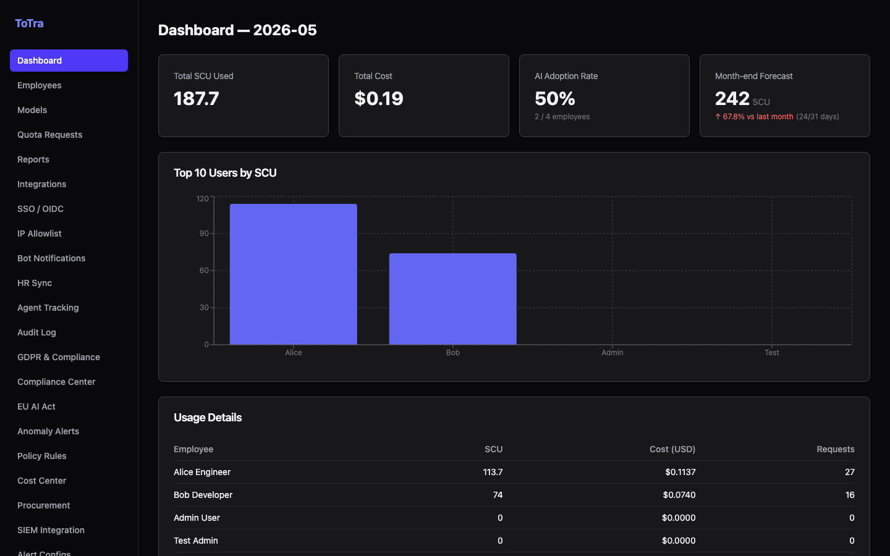
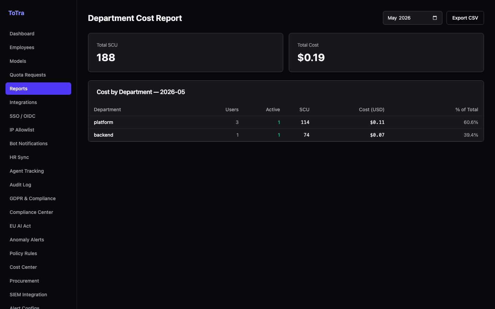
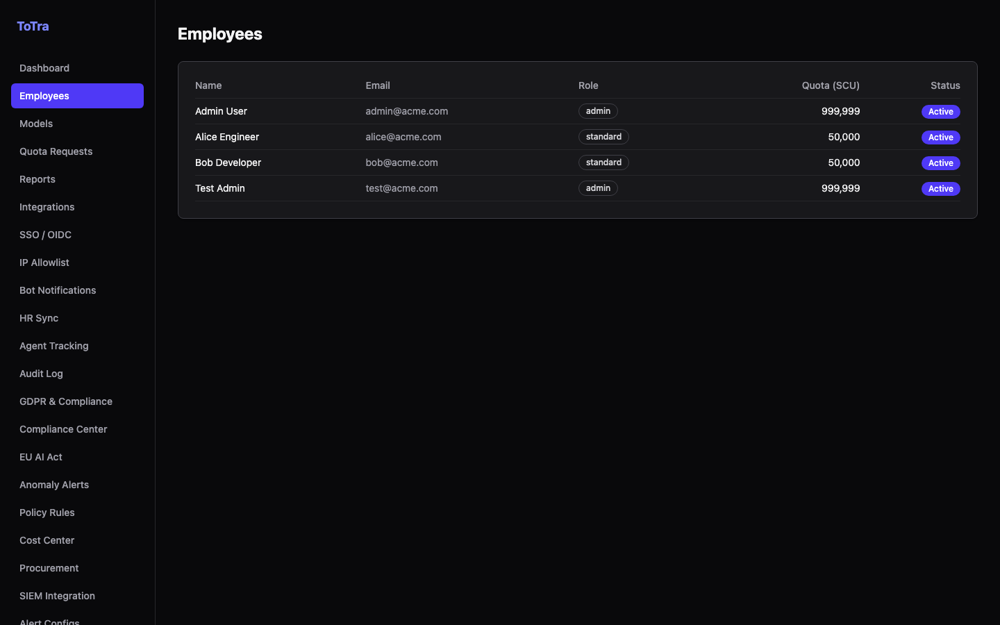
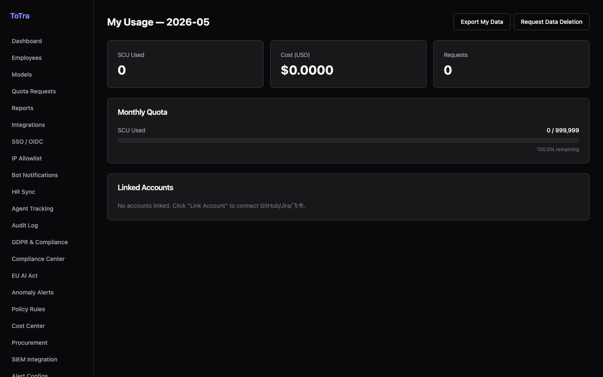

<h1 align="center">ToTra — AI Spend Management & LLM Gateway</h1>

<p align="center">
  Open-source AI gateway for enterprises. One line of code to add quota, PII protection, cost tracking, and compliance to any LLM.
</p>

<p align="center">
  <a href="LICENSE"></a>
  <a href="docker-compose.yml"></a>
  <a href="../../issues"></a>
</p>

<p align="center">
  <a href="docs/gateway.md">Gateway Docs</a> · <a href="docs/admin.md">Admin API</a> · <a href="docs/quickstart.md">Quick Start</a> · <a href="https://yourorg.github.io/totra">Website</a>
</p>

---


---

## What is ToTra

ToTra is an open-source LLM gateway and AI governance platform that sits between your applications and any LLM provider.

Point your apps at ToTra instead of OpenAI or Anthropic — get spend tracking, per-user quota, PII blocking, and a full compliance audit trail with **zero changes to your existing code**.

---

## Why ToTra

- **One gateway, any model** — OpenAI, Anthropic, Gemini, local models — all behind one OpenAI-compatible endpoint
- **Hard budget caps** — per-user and per-team quota; requests over limit get `429` before touching any provider
- **PII blocked at the edge** — 18 language groups scanned in real time; sensitive data never reaches the LLM
- **Compliance out of the box** — GDPR workflows, EU AI Act checklist, immutable audit chain, data retention policies
- **Finance-ready reporting** — department chargeback CSV, budget forecasts, procurement analytics, anomaly alerts
- **Self-hosted** — your data stays on your infrastructure

---

## Screenshots

| Admin Dashboard | Department Reports |
|---|---|
|  |  |

| Employee Management | Employee Self-Service |
|---|---|
|  |  |

---

## Get Started in 5 Minutes

```bash
git clone https://github.com/yourorg/totra.git
cd totra
cp .env.example .env
docker-compose --profile app up -d --wait
```

Open **http://localhost:3000** → sign in with `admin@acme.com` / `totra123`

---

## Connect Your Apps

Change one line. Everything else stays the same.

<details open>
<summary><b>Python (OpenAI SDK)</b></summary>

```python
import openai

# Before
client = openai.OpenAI(api_key="sk-...")

# After — zero other changes
client = openai.OpenAI(
    api_key="your-totra-api-key",
    base_url="http://your-totra-host:8080/v1"
)

response = client.chat.completions.create(
    model="gpt-4o",
    messages=[{"role": "user", "content": "Hello!"}]
)
```

</details>

<details>
<summary><b>Node.js (OpenAI SDK)</b></summary>

```javascript
import OpenAI from "openai";

const client = new OpenAI({
  apiKey: "your-totra-api-key",
  baseURL: "http://your-totra-host:8080/v1",
});

const response = await client.chat.completions.create({
  model: "gpt-4o",
  messages: [{ role: "user", content: "Hello!" }],
});
```

</details>

<details>
<summary><b>curl</b></summary>

```bash
curl http://your-totra-host:8080/v1/chat/completions \
  -H "Authorization: Bearer your-totra-api-key" \
  -H "Content-Type: application/json" \
  -d '{
    "model": "gpt-4o",
    "messages": [{"role": "user", "content": "Hello!"}]
  }'
```

</details>

Once connected, every request flows through quota enforcement, PII scanning, and cost tracking automatically.

---

## Features

<details open>
<summary><b>Cost & Spend Management</b></summary>

- Per-user, per-team, per-model token and USD cost tracking
- Budget caps with configurable alert thresholds (Slack / webhook)
- Monthly budget forecast based on current burn rate
- Department chargeback reports with CSV export
- Procurement analytics and ROI reports
- Anomaly detection on spend spikes

Admin dashboard:

```
http://localhost:3000/admin/cost
http://localhost:3000/admin/reports
```

</details>

<details>
<summary><b>PII Protection — 18 Language Groups</b></summary>

Every request body is scanned before it reaches any LLM. Blocked requests return `422` and emit a SIEM event.

| Language | Detected types |
|----------|----------------|
| Universal | Email, credit card, IBAN, SWIFT/BIC, ICD medical codes |
| Chinese | ID card, phone, bank account, unified credit code, securities account |
| English | US SSN, phone, NI number, passport, driver's license, medical record number |
| Japanese | My Number (個人番号), phone, postal code, health insurance number |
| Korean | RRN (주민등록번호), phone, passport, business registration number |
| EU (DE/FR/ES/IT/NL/PL/SE/PT/BE/CH/DK/FI/NO) | National IDs, tax numbers, social security numbers, phone |
| Arabic (GCC + MENA) | National ID, Iqama, Emirates ID, QID, CIN, NIN, phone |

</details>

<details>
<summary><b>Compliance & Audit</b></summary>

- **GDPR** — data-subject export and deletion request workflows
- **EU AI Act** — compliance checklist with status tracking
- **Audit chain** — hash-chained immutable log; every request is traceable
- **Data retention** — configurable policies with automated cleanup
- **Industry frameworks** — extensible compliance framework support
- **SIEM** — configurable webhook targets for security event forwarding

</details>

<details>
<summary><b>Gateway & Routing</b></summary>

- OpenAI-compatible and Anthropic-compatible API endpoints
- Multi-provider routing — OpenAI, Anthropic, Gemini, local models
- Intelligent model auto-routing and fallback
- Per-tenant Redis-backed quota enforcement
- Prompt compression to reduce token spend
- Semantic cache (SimHash LSH) to deduplicate repeated prompts
- Streaming (`text/event-stream`) proxy
- File upload → parse → chat pipeline (PDF / DOCX / PPTX)
- Rate limiting, IP allowlist, API-key auth

</details>

<details>
<summary><b>Administration</b></summary>

- JWT authentication + OIDC / SSO integration
- Role-based access control (admin / employee)
- User and team management
- Model catalogue — enable / disable / configure providers
- Quota request / approval workflow
- Bot notifications (Slack, Feishu, webhook)
- HR sync connector (CSV-based)
- Agent session tracking and dead-loop detection

</details>

---

## Architecture

```
Your Apps
   ↓
ToTra Gateway :8080          ← auth · quota · PII · policy · routing
   ↓
OpenAI / Anthropic / Gemini / Local models

   ↕ usage events

ToTra Admin :8081            ← cost · compliance · budgets · audit
   ↕
Dashboard :3000              ← admin console + employee self-service
```

| Service     | Stack                 | Port |
|-------------|-----------------------|------|
| `gateway`   | Go 1.26 / Fiber       | 8080 |
| `admin`     | Go 1.26 / Fiber       | 8081 |
| `parser`    | Python 3.12 / FastAPI | 8090 |
| `dashboard` | React 19 / Vite       | 3000 |
| `postgres`  | PostgreSQL 16         | 5432 |
| `redis`     | Redis 7               | 6379 |

---

## Local Development

```bash
# Start databases
docker-compose up -d postgres redis

# Run services (each in its own terminal)
cd gateway   && go run .
cd admin     && go run .
cd parser    && uvicorn main:app --port 8090
cd dashboard && npm install && npm run dev

# Seed dev passwords (first time only)
cd scripts/set-dev-passwords
POSTGRES_HOST=localhost POSTGRES_DB=totra \
POSTGRES_USER=totra POSTGRES_PASSWORD=totra_secret go run .
```

**Default dev credentials**: `admin@acme.com` / `totra123`

---

## Configuration

Copy `.env.example` to `.env`. Required variables:

| Variable                 | Description                              |
|--------------------------|------------------------------------------|
| `POSTGRES_*`             | PostgreSQL connection (host/port/db/user/password) |
| `JWT_SECRET`             | Shared secret for JWT signing            |
| `ENCRYPTION_KEY`         | 32-byte hex key (admin credential store) |
| `GATEWAY_ENCRYPTION_KEY` | 32-byte hex key (gateway credential store) |

See `.env.example` for the full list including optional variables.

---

## Testing

```bash
make test

# Per service
cd gateway   && go test ./...
cd admin     && go test ./...
cd dashboard && npm run test:run
cd parser    && pytest
```

---

## Roadmap

- [ ] `totra` CLI (npm / brew)
- [ ] Kubernetes Helm chart
- [ ] Terraform provider
- [ ] Google Workspace / Azure AD SSO out of the box
- [ ] Multi-region tenant isolation

Contributions welcome — open an issue or PR.

---

## License

[MIT](LICENSE) — free to use, self-host, and modify.
