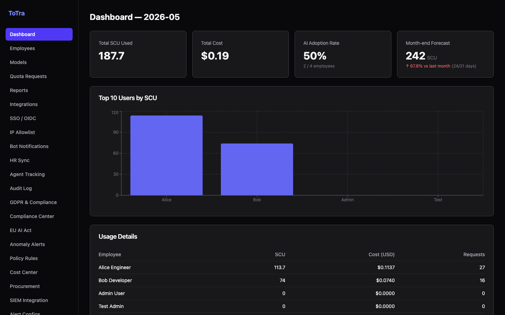
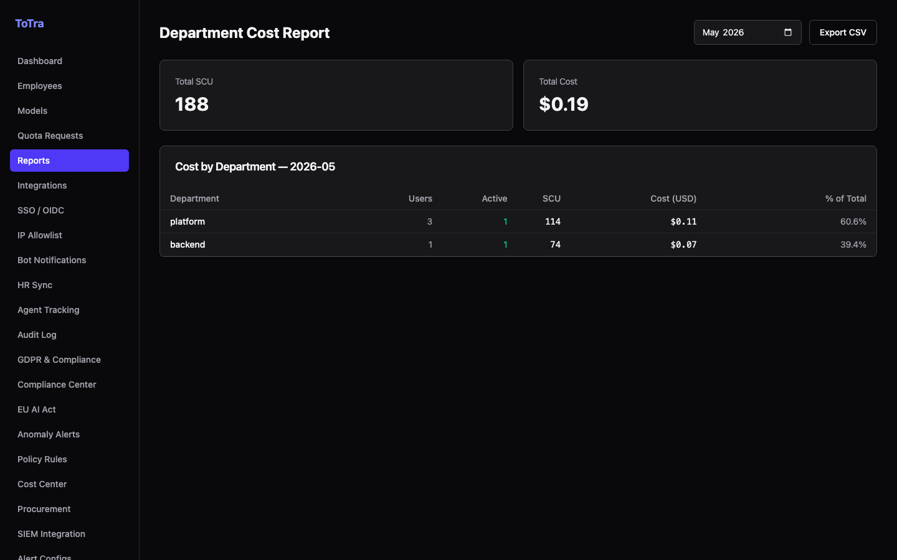
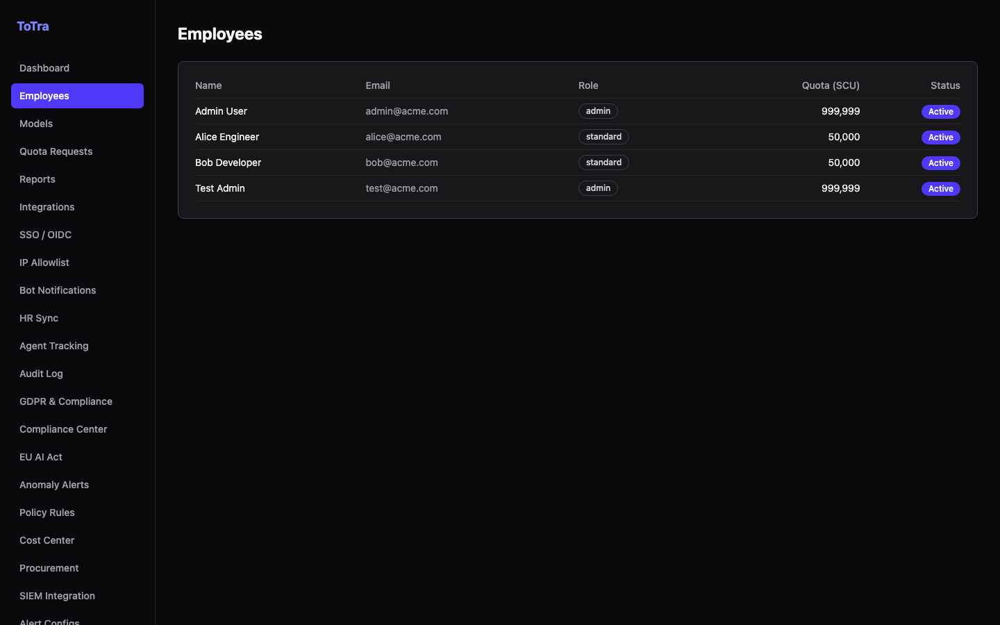
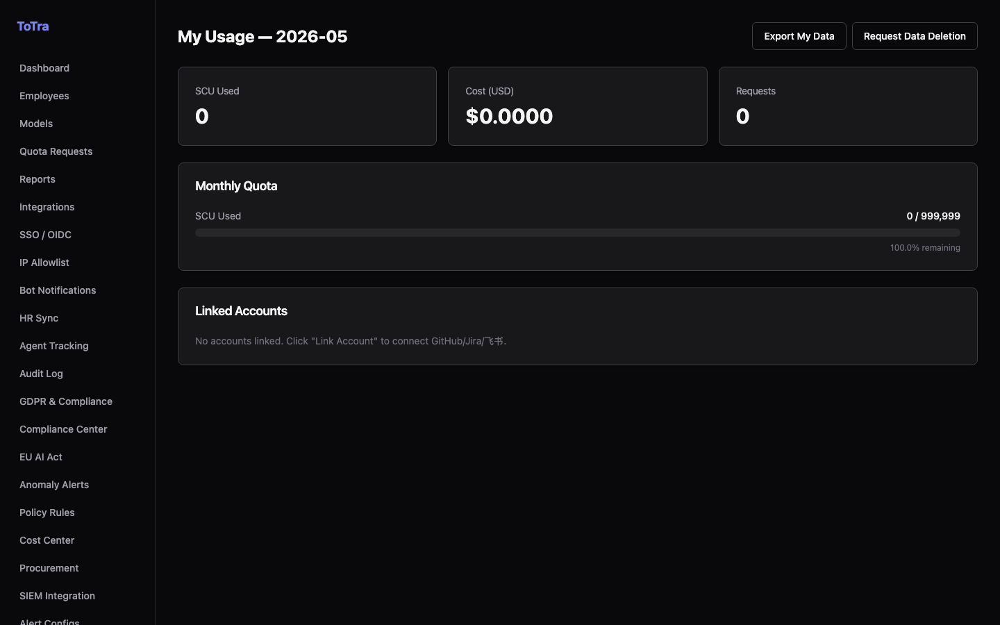

<h1 align="center">
  🛡️ ToTra
</h1>
<p align="center">
  <strong>AI Gateway & Governance Platform</strong><br>
  Open-source LLM proxy written in Go. Add quota enforcement, PII blocking, cost tracking, and compliance to any LLM in one line of code.
</p>

<p align="center">
  <a href="https://railway.com/template/totra">
    
  </a>
</p>

<p align="center">
  <a href="LICENSE"></a>
  <a href="https://github.com/SugaC-275/ToTra"></a>
  
  
  
</p>

<p align="center">
  <a href="#get-started-in-5-minutes">Quick Start</a> ·
  <a href="#connect-your-apps">Integration Guide</a> ·
  <a href="#features">Features</a> ·
  <a href="#architecture">Architecture</a> ·
  <a href="docs/gateway.md">Gateway Docs</a> ·
  <a href="docs/admin.md">Admin API</a> ·
  <a href="https://github.com/SugaC-275/ToTra/discussions">Discussions</a>
</p>

---

<p align="center">
  
</p>

---

## What is ToTra

ToTra is an open-source AI gateway and governance platform that sits in front of any LLM provider.

Point your existing apps at ToTra instead of OpenAI, Anthropic, or any other provider — and instantly get:

- **Quota enforcement** — per-user and per-team hard budget caps
- **PII blocking** — 18 language groups scanned at the edge before any data leaves your network
- **Cost tracking** — per-user, per-team, per-model token and USD spend with chargeback reports
- **Compliance** — GDPR workflows, EU AI Act checklist, hash-chained immutable audit log
- **Zero code changes** — 100% OpenAI-compatible; swap one line in your config

---

## Why ToTra

- 🚀 **Written in Go** — < 2 ms p95 overhead. Native binary, no Python runtime, no warm-up.
- 🔒 **PII blocked at the edge** — email, IDs, credit cards, health records across 18 language groups. Sensitive data is redacted before it ever reaches an LLM.
- 💸 **Hard budget caps** — requests over limit get `429` before touching any provider. Real-time Slack / webhook alerts.
- 📋 **Compliance out of the box** — GDPR data-subject workflows, EU AI Act checklist, and an immutable hash-chained audit log on every request.
- 📊 **Finance-ready reporting** — department chargeback CSV, budget forecasts, spend anomaly detection.
- 🏠 **Self-hosted** — your keys, your infrastructure, your data. No external dependency.

---

## Get Started in 5 Minutes

**Prerequisites:** Docker + Docker Compose

```bash
git clone https://github.com/SugaC-275/ToTra.git
cd ToTra
cp .env.example .env          # fill in your provider API keys
docker-compose --profile app up -d --wait
```

Open **[http://localhost:3000](http://localhost:3000)** and sign in:

| Field | Value |
|---|---|
| Email | `admin@acme.com` |
| Password | `totra123` |

> Change default credentials immediately after first login via **Settings → Security**.

---

## Connect Your Apps

One line change. Every other line of code stays the same.

<details open>
<summary><b>Python (OpenAI SDK)</b></summary>

```python
import openai

# Before — calls OpenAI directly
client = openai.OpenAI(api_key="sk-...")

# After — routes through ToTra (zero other changes)
client = openai.OpenAI(
    api_key="your-totra-api-key",      # issued from the ToTra admin panel
    base_url="http://your-totra-host:8080/v1"
)

response = client.chat.completions.create(
    model="gpt-4o",
    messages=[{"role": "user", "content": "Hello!"}]
)
print(response.choices[0].message.content)
```

</details>

<details>
<summary><b>Node.js / TypeScript (OpenAI SDK)</b></summary>

```typescript
import OpenAI from "openai";

const client = new OpenAI({
  apiKey: "your-totra-api-key",
  baseURL: "http://your-totra-host:8080/v1",
});

const response = await client.chat.completions.create({
  model="gpt-4o",
  messages: [{ role: "user", content: "Hello!" }],
});
console.log(response.choices[0].message.content);
```

</details>

<details>
<summary><b>curl</b></summary>

```bash
curl http://your-totra-host:8080/v1/chat/completions \
  -H "Authorization: Bearer your-totra-api-key" \
  -H "Content-Type: application/json" \
  -d '{
    "model": "gpt-4o",
    "messages": [{"role": "user", "content": "Hello!"}]
  }'
```

</details>

<details>
<summary><b>LangChain</b></summary>

```python
from langchain_openai import ChatOpenAI

llm = ChatOpenAI(
    model="gpt-4o",
    openai_api_key="your-totra-api-key",
    openai_api_base="http://your-totra-host:8080/v1",
)

response = llm.invoke("Hello!")
print(response.content)
```

</details>

Once connected, every request is automatically routed through quota enforcement, PII scanning, semantic caching, and cost tracking.

---

## Features

<details open>
<summary><b>🔒 PII Protection — 18 Language Groups</b></summary>

Every request body is scanned in real time before it reaches any LLM. Detected PII is redacted and the event is logged. Blocked requests return `422`.

| Language Group | Detected Types |
|---|---|
| Universal | Email, credit card, IBAN, SWIFT/BIC, ICD medical codes |
| Chinese | National ID, phone, bank account, unified credit code, securities account |
| English | US SSN, phone, NI number, passport, driver's license, medical record number |
| Japanese | My Number (個人番号), phone, postal code, health insurance number |
| Korean | RRN (주민등록번호), phone, passport, business registration number |
| EU (14 countries) | National IDs, tax numbers, social security — DE/FR/ES/IT/NL/PL/SE/PT/BE/CH/DK/FI/NO/AT |
| Arabic (GCC + MENA) | National ID, Iqama, Emirates ID, QID, CIN, NIN, phone |

Configure rules per team, per model, or globally in the admin panel.

</details>

<details>
<summary><b>💸 Cost & Spend Management</b></summary>

- Per-user, per-team, per-model token and USD cost tracking
- **Hard budget caps** — requests over limit get `429` before touching the provider
- Configurable alert thresholds with Slack / Feishu / webhook notifications
- Monthly budget forecasts based on current burn rate
- **Department chargeback reports** with CSV export for finance
- Procurement analytics and ROI dashboards
- Spend anomaly detection with automatic alerts

```
Dashboard → Cost → Reports → Export CSV
```

</details>

<details>
<summary><b>📋 Compliance & Audit</b></summary>

- **GDPR** — data-subject export and deletion request workflows, configurable retention policies
- **EU AI Act** — compliance checklist with per-model status tracking
- **Immutable audit chain** — every request is hash-chained; the log cannot be tampered with
- **SIEM integration** — configurable webhook targets for security event forwarding
- Data residency controls — keep all data on-premises or in a specific region

</details>

<details>
<summary><b>⚡ Gateway & Routing</b></summary>

- **OpenAI-compatible** — drop-in replacement for the OpenAI API (`/v1/chat/completions`, `/v1/embeddings`, streaming)
- **Anthropic-compatible** — native Anthropic messages API support
- Multi-provider routing — automatic fallback across providers and models
- **Semantic cache** — SimHash LSH deduplication; repeated prompts skip the LLM entirely
- Prompt compression — reduce token spend on long context
- Streaming proxy — full `text/event-stream` support
- **File pipeline** — upload PDF / DOCX / PPTX → parse → chat in one API call
- Rate limiting, IP allowlist, API-key authentication

</details>

<details>
<summary><b>🔐 Administration</b></summary>

- JWT authentication + OIDC / SSO integration
- Role-based access control (admin / employee)
- User and team management with quota request / approval workflow
- Model catalogue — enable, disable, and configure providers per team
- Bot notifications — Slack, Feishu, custom webhooks
- HR sync connector (CSV import)
- **Agent session tracking** — detects and terminates dead-loop agent sessions automatically

</details>

---

## Supported Providers

| Provider | Chat | Embeddings | Streaming | Files |
|---|:---:|:---:|:---:|:---:|
| OpenAI (GPT-4o, o1, o3, o4) | ✅ | ✅ | ✅ | ✅ |
| Anthropic (Claude 3.5, 4) | ✅ | — | ✅ | ✅ |
| Google Gemini | ✅ | ✅ | ✅ | — |
| Mistral AI | ✅ | ✅ | ✅ | — |
| Meta Llama (via Ollama) | ✅ | ✅ | ✅ | — |
| Cohere Command | ✅ | ✅ | ✅ | — |
| Azure OpenAI | ✅ | ✅ | ✅ | ✅ |
| AWS Bedrock | ✅ | ✅ | ✅ | — |
| Local / Ollama | ✅ | ✅ | ✅ | — |
| Any OpenAI-compatible endpoint | ✅ | ✅ | ✅ | — |

---

## Performance

ToTra is written entirely in Go. The gateway adds **< 2 ms** overhead at p95 under production load.

| Concurrency | p50 | p95 | p99 |
|:-----------:|:---:|:---:|:---:|
| 10 VUs  | < 1 ms | 2 ms  | 4 ms  |
| 50 VUs  | 1 ms   | 3 ms  | 8 ms  |
| 200 VUs | 2 ms   | 6 ms  | 15 ms |

> Measured against a 100 ms mock upstream. [Reproduce the benchmark →](scripts/benchmark/README.md)

---

## Architecture

```
Your Apps  (OpenAI SDK / curl / LangChain / any HTTP client)
    │
    ▼
ToTra Gateway  :8080
    auth · quota · PII scan · policy · semantic cache · routing
    │
    ▼
OpenAI · Anthropic · Gemini · Mistral · Local Models
    │
    │ (usage events)
    ▼
ToTra Admin  :8081
    cost · compliance · budgets · audit trail · notifications
    │
    ▼
Dashboard  :3000
    admin console · department reports · employee self-service
```

| Service | Stack | Port |
|---|---|:---:|
| `gateway` | Go 1.25 / Fiber | 8080 |
| `admin` | Go 1.25 / Fiber | 8081 |
| `parser` | Python 3.12 / FastAPI | 8090 |
| `dashboard` | React 19 / Vite | 3000 |
| `postgres` | PostgreSQL 16 | 5432 |
| `redis` | Redis 7 | 6379 |

---

## Screenshots

| Cost Dashboard | Department Reports |
|---|---|
|  |  |

| User Management | Employee Self-Service |
|---|---|
|  |  |

---

## Local Development

```bash
# 1. Start databases
docker-compose up -d postgres redis

# 2. Run each service in its own terminal
cd gateway   && go run .
cd admin     && go run .
cd parser    && uvicorn main:app --port 8090
cd dashboard && npm install && npm run dev

# 3. Seed dev credentials (first time only)
cd scripts/set-dev-passwords
POSTGRES_HOST=localhost POSTGRES_DB=totra \
POSTGRES_USER=totra POSTGRES_PASSWORD=totra_secret go run .
```

**Default dev credentials:** `admin@acme.com` / `totra123`

---

## Configuration

Copy `.env.example` to `.env`. Key variables:

| Variable | Description |
|---|---|
| `POSTGRES_HOST/PORT/DB/USER/PASSWORD` | PostgreSQL connection |
| `JWT_SECRET` | Shared secret for JWT signing |
| `ENCRYPTION_KEY` | 32-byte hex key — admin credential store |
| `GATEWAY_ENCRYPTION_KEY` | 32-byte hex key — gateway credential store |
| `OPENAI_API_KEY` | Your OpenAI key (set per provider) |
| `ANTHROPIC_API_KEY` | Your Anthropic key |

See [`.env.example`](.env.example) for the full list including Redis, SMTP, and notification settings.

---

## Testing

```bash
make test

# Per service
cd gateway   && go test ./...
cd admin     && go test ./...
cd dashboard && npm run test:run
cd parser    && pytest
```

---

## Contributing

We welcome contributions — bug fixes, new provider integrations, docs improvements, and feature requests.

```bash
git clone https://github.com/SugaC-275/ToTra.git
cd ToTra

# Run tests before submitting
make test
```

1. Fork the repo and create a branch from `main`
2. Make your change and add tests where relevant
3. Ensure `make test` passes
4. Open a pull request

For larger features, open a [Discussion](https://github.com/SugaC-275/ToTra/discussions) first to align on direction.

---

## Support

- 💬 [GitHub Discussions](https://github.com/SugaC-275/ToTra/discussions) — questions, ideas, show & tell
- 🐛 [GitHub Issues](https://github.com/SugaC-275/ToTra/issues) — bug reports

---

## License

[MIT](LICENSE) — free to use, self-host, fork, and modify.
